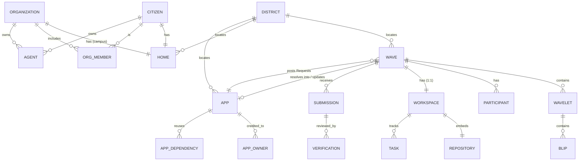

# Mombasa — Domain Model

A rigorous, DDD-style domain model for Mombasa. Where `DESIGN.md` describes
*how the system works*, this document defines *what the things are*: the
bounded contexts, aggregates, entities, value objects, enumerations,
relationships, and — most importantly — the **invariants** each aggregate
protects.

It reflects the decisions locked in `DESIGN.md §0` (Wave as the core primitive,
agents as participants, native git, homes, apps, adoption rewards, multi-
discipline work). Open naming threads (Quest→Wave, "App") are resolved here to
**Wave** and **App** pending a final call.

Kotlin sketches are illustrative of intent (types, identity, invariants) — not
the final code; the project scaffold comes in Phase 0.

---

## 1. Modeling conventions

- **Strongly-typed identity.** Every aggregate has a typed id (a Kotlin
  `value class` over `UUID`, v7 for sortable ids) — no bare `UUID`/`String` ids
  crossing boundaries.
- **Aggregates are small.** Consistency boundaries are kept tight; cross-
  aggregate references are **by id**, never by object graph. Aggregates in
  different contexts stay consistent via **domain events** (eventual
  consistency), not foreign keys.
- **Value objects are immutable** and have no identity (`Money`, `GitRef`,
  `Skill`, `ActorRef`).
- **Externalized state.** Live code lives in **git**; live document edits live
  in **CRDT docs**. The relational model stores *metadata and references*
  (e.g. a `GitRef`), not file content.
- **Polymorphic actors.** Citizens, Organizations, and Agents are all *Actors*;
  anything that references "who" uses the `ActorRef` value object, not a
  nullable FK per type.

---

## 2. Bounded contexts (context map)

```
┌──────────────┐  ActorRef   ┌──────────────┐  WaveResolved   ┌──────────────┐
│  Identity    │────────────▶│ Collaboration│────────────────▶│    Apps      │
│ (Actors)     │             │   (Waves)    │  AppLaunched    │ (Products)   │
└──────┬───────┘             └──────┬───────┘                 └──────┬───────┘
       │                            │ Committed / Submission         │ AppUsed
       │                            ▼                                │
       │                     ┌──────────────┐                        │
       │                     │   Workspace  │                        │
       │                     │  (Code/git)  │                        │
       │                     └──────────────┘                        │
       │                                                             │
       ▼  events (ReputationAwarded, RewardPaid, …)                  ▼
┌──────────────────────────────────────────────────────────────────────────┐
│           Reputation & Rewards   ·   City (projection)   ·   Feed          │
│                         (downstream / read models)                         │
└──────────────────────────────────────────────────────────────────────────┘
```

| Context | Owns | Kind |
| --- | --- | --- |
| **Identity** | Citizen, Organization, Agent, Home | Core |
| **Collaboration** | Wave, Wavelet, Blip, Participant, Gadget | Core |
| **Workspace** | Workspace, Repository, Task, Submission, Verification | Core |
| **Apps** | App, AppOwner, AppDependency | Core |
| **Economy** | ReputationLedger, RewardLedger, **CreditWallet, UsageRecord, Subscription, PriceList** | Supporting + billing |
| **City** | City, District, Street, Plot, CityMetric | Downstream projection |
| **Feed / Notifications** | Feed entries, Notifications | Downstream projection |

Identity is **upstream** of everything (it defines who acts). Reputation/Rewards,
City, and Feed are **downstream projections** built from events — they never
write back into the core contexts. This is the "you can't fake the city"
property expressed structurally.

---

## 3. Cross-cutting building blocks

### 3.1 Actors & identity

```kotlin
enum class ActorType { CITIZEN, ORGANIZATION, AGENT }

/** Polymorphic reference to any actor, used across every context. */
data class ActorRef(val type: ActorType, val id: UUID)

/**
 * Actor — the unifying concept. Citizen, Organization, and Agent are the three
 * concrete actor *aggregates* (each with its own invariants); `Actor` is their
 * shared read-model projection, used wherever the UI/feed/participation list
 * just needs "who" cheaply, without caring which kind it is.
 */
data class Actor(
    val ref: ActorRef,
    val handle: String,
    val displayName: String,
    val avatarUrl: Url?,
    val homeAddress: Address?,           // where they live in the city (§9)
    val reputationGlobal: Long,
)

@JvmInline value class CitizenId(val value: UUID)
@JvmInline value class OrgId(val value: UUID)
@JvmInline value class AgentId(val value: UUID)
@JvmInline value class HomeId(val value: UUID)
@JvmInline value class WaveId(val value: UUID)
@JvmInline value class WaveletId(val value: UUID)
@JvmInline value class AppId(val value: UUID)
@JvmInline value class WorkspaceId(val value: UUID)
@JvmInline value class SubmissionId(val value: UUID)
@JvmInline value class DistrictId(val value: UUID)
@JvmInline value class StreetId(val value: UUID)
```

### 3.2 Shared value objects

```kotlin
data class Money(val amount: BigDecimal, val currency: Currency)         // real money (decision D)
@JvmInline value class Points(val value: Long)                          // in-platform XP/points
@JvmInline value class Credits(val micros: Long)                        // spendable resource budget; maps to real cost
data class Skill(val name: String, val discipline: Discipline)
data class GitRef(val repo: RepoId, val sha: String)                    // an exact commit
data class Percentage(val basisPoints: Int) { init { require(basisPoints in 0..10_000) } }
```

**Three currencies, kept distinct:** **Reputation** (earned status, not
spendable, §8.1) · **Credits** (earned/granted/bought resource budget that is
*consumed by real compute & storage*, §8.4) · **Money** (real money, gated by
decision D). Don't conflate them.

### 3.3 Enumerations (the ubiquitous vocabulary)

```kotlin
enum class AutonomyLevel { SUGGEST, ACT_IN_SANDBOX, AUTONOMOUS }
enum class WaveKind      { ISSUE, CHALLENGE, COMPETITION, IDEA }
enum class Discipline    { CODING, DESIGN, MARKETING, DOCS, OPS, JOBS }   // extensible
enum class WaveStatus    { DRAFT, OPEN, IN_PROGRESS, IN_REVIEW, RESOLVED, ARCHIVED, CANCELLED }
enum class WaveVisibility { PUBLIC, UNLISTED, PRIVATE }   // public feed · invite-only/link · participants-only
enum class Visibility    { PUBLIC, TEAM, PRIVATE }        // per-wavelet sub-space access
enum class ResourceType  { COMPUTE_SECONDS, STORAGE_BYTES, LLM_TOKENS, TOOL_CALL, EGRESS_BYTES, APP_HOSTING }
enum class ParticipantRole { LEAD, CONTRIBUTOR, REVIEWER, OBSERVER }
enum class BlipType      { MESSAGE, DOCUMENT, CODE, GADGET }
enum class GadgetType    { LIFECYCLE, BOUNTY, CODE_WORKSPACE, VERIFICATION, MAP, APP_LINK, POLL }
enum class SubmissionStatus  { DRAFT, SUBMITTED, IN_REVIEW, ACCEPTED, REJECTED }
enum class VerificationOutcome { PENDING, PASS, FAIL }
enum class AppStatus     { DRAFT, LAUNCHED, SUSPENDED, RETIRED }
enum class RewardKind    { POINTS, XP, BADGE, CREDITS, MONEY, REVENUE_SHARE }
enum class PlanTier      { FREE, PRO, ORG, ENTERPRISE }
enum class ReputationScope { GLOBAL, SKILL, DISTRICT }
enum class PlotType      { EMPTY, HOME, CAMPUS, BUILDING, APP, LANDMARK, BLIGHT, PARK }
```

---

## 4. Identity context

### 4.1 Citizen (aggregate root)

A human user.

```kotlin
class Citizen(
    val id: CitizenId,
    var handle: Handle,                 // unique, immutable-ish
    var displayName: String,
    val email: Email,
    val homeId: HomeId,                 // every citizen has exactly one home (§0.8)
    val skills: MutableSet<Skill>,
    var status: AccountStatus,          // ACTIVE, SUSPENDED, DEACTIVATED
    val createdAt: Instant,
) {
    fun actorRef() = ActorRef(ActorType.CITIZEN, id.value)
}
```

**Invariants:** `handle` is globally unique; a Citizen always has exactly one
`Home`; reputation is *not* stored here (it's a downstream projection, §8).

### 4.2 Organization (aggregate root)

```kotlin
class Organization(
    val id: OrgId,
    var name: String,
    val slug: Slug,                     // unique
    var verified: Boolean,              // §10 org verification
    val members: MutableList<OrgMember>,// entity within the aggregate
    val campusId: HomeId,               // an org's "home" is a campus
    val createdAt: Instant,
)
data class OrgMember(val citizen: CitizenId, val role: OrgRole) // OWNER, ADMIN, MEMBER
```

**Invariants:** at least one `OWNER`; only `verified` orgs may post real-money
jobs (§6 bridge); `slug` unique.

### 4.3 Agent (aggregate root)

An AI participant — a peer, not a tool.

```kotlin
class Agent(
    val id: AgentId,
    val owner: ActorRef,                // a Citizen or Organization, accountable
    var name: String,
    val manifest: SkillManifest,        // declared capabilities for auto-match
    var autonomy: AutonomyLevel,
    val scope: PermissionScope,         // allowlisted tools, spend & rate limits
    var status: AgentStatus,            // ACTIVE, PAUSED, KILLED
    val createdAt: Instant,
)
data class SkillManifest(val skills: Set<Skill>)
data class PermissionScope(
    val allowedTools: Set<String>,
    val creditBudget: Credits,          // hard resource budget; agent halts when exhausted (§8.4)
    val rateLimitPerHour: Int,
)
```

**Invariants:** `owner` must be a CITIZEN or ORGANIZATION (never another agent);
`AUTONOMOUS` requires owner trust level ≥ threshold; a `KILLED` agent can take
no actions (kill-switch).

### 4.4 Home (aggregate root)

The onboarding anchor (§0.8). One per Citizen; a `CAMPUS` variant per Org.

```kotlin
class Home(
    val id: HomeId,
    val owner: ActorRef,                // Citizen or Organization
    val districtId: DistrictId,
    var plot: PlotCoords,
    var level: Int,                     // upgrades with reputation milestones
)
```

**Invariants:** exactly one Home per owner; `level >= 1`.

---

## 5. Collaboration context (Waves)

The heart of the model. To keep aggregates small, the **Wave**, **Wavelet**,
and **Blip** are *separate aggregates* (a wave can have huge, concurrently-edited
content; one giant aggregate would be a contention nightmare).

### 5.1 Wave (aggregate root)

```kotlin
class Wave(
    val id: WaveId,
    val kind: WaveKind,
    val discipline: Discipline,
    var title: String,
    var brief: String,
    var status: WaveStatus,
    var visibility: WaveVisibility,     // PUBLIC feed · UNLISTED (invite/link) · PRIVATE
    val districtId: DistrictId,
    val creator: ActorRef,              // a Citizen, Org, or an App-on-behalf
    val sourceApp: AppId?,              // set when an App posts this Request (§3.2)
    val rewardPolicy: RewardPolicy,     // the Bounty gadget's rules
    val deadline: Instant?,             // required for COMPETITION
    val skills: Set<Skill>,
    val tags: Set<String>,
    val participants: MutableList<Participant>,
    val waveletIds: MutableList<WaveletId>, // references, not contained objects
    val createdAt: Instant,
) {
    fun join(actor: ActorRef, role: ParticipantRole) {
        require(status == WaveStatus.OPEN || status == WaveStatus.IN_PROGRESS) {
            "Cannot join a Wave that is $status"
        }
        require(participants.none { it.actor == actor }) { "Already a participant" }
        participants += Participant(actor, role, Instant.now())
        if (status == WaveStatus.OPEN) status = WaveStatus.IN_PROGRESS
    }
}
data class Participant(val actor: ActorRef, val role: ParticipantRole, val joinedAt: Instant)
data class RewardPolicy(val pool: List<RewardGrant>)
data class RewardGrant(val kind: RewardKind, val points: Points?, val money: Money?, val badge: String?)
```

**Invariants:**
- Status transitions follow the lifecycle in `DESIGN.md §2.4`; illegal jumps
  are rejected.
- A `COMPETITION` **must** have a `deadline`; an `IDEA` may not have a code
  workspace until promoted.
- Participants are added only while `OPEN`/`IN_PROGRESS`. A `PUBLIC` wave may be
  joined by application; an `UNLISTED`/`PRIVATE` wave is **invite-only** (not in
  the public feed) and `join` requires a valid invitation.
- `RESOLVED` requires an `ACCEPTED` `Submission` (enforced via the Workspace
  context on the `SubmissionAccepted` event).
- At least one participant has role `LEAD` once `IN_PROGRESS`.

### 5.2 Wavelet (aggregate root) — the access-control & concurrency unit

```kotlin
class Wavelet(
    val id: WaveletId,
    val waveId: WaveId,
    var name: String,
    var visibility: Visibility,         // PUBLIC statement vs TEAM workspace, etc.
    val blipIds: MutableList<BlipId>,
)
```

**Invariants:** belongs to exactly one Wave; visibility governs participant
access (checked in the application layer against the Wave's participants).

### 5.3 Blip (aggregate root) — atomic content unit

```kotlin
class Blip(
    val id: BlipId,
    val waveletId: WaveletId,
    val type: BlipType,
    val author: ActorRef,               // a Citizen, Org, or Agent
    val parentBlipId: BlipId?,          // threading
    val content: BlipContent,           // see below — content may be externalized
    val createdAt: Instant,
)

/** Content is stored where it belongs, referenced by the blip. */
sealed interface BlipContent {
    data class Message(val text: String) : BlipContent
    data class Document(val crdtDocId: String) : BlipContent       // live CRDT doc
    data class Code(val gitRef: GitRef) : BlipContent              // git-backed
    data class Gadget(val gadgetType: GadgetType, val data: JsonNode) : BlipContent
}
```

**Invariants:** `parentBlipId`, if present, is in the same wavelet; a `Code`
blip's `GitRef` resolves in the Wave's workspace repo.

---

## 6. Workspace context (code & verification)

### 6.1 Workspace (aggregate root)

```kotlin
class Workspace(
    val id: WorkspaceId,
    val waveId: WaveId,                  // 1:1 with the Wave it serves
    val repo: Repository,               // the embedded git repo (JGit)
    val tasks: MutableList<Task>,
)
data class Repository(val id: RepoId, val defaultRef: String, val storageKey: String)
data class Task(val id: TaskId, var title: String, var status: TaskStatus, var assignee: ActorRef?)
```

**Invariants:** exactly one Workspace per Wave; a Task's `assignee` is a
participant of the Wave.

### 6.2 Submission (aggregate root)

A submission **is a git ref** (§DESIGN 5.3), not a link.

```kotlin
class Submission(
    val id: SubmissionId,
    val waveId: WaveId,
    val ref: GitRef,                    // the exact commit submitted
    var status: SubmissionStatus,
    val verifications: MutableList<Verification>,
    val createdAt: Instant,
) {
    fun accept(by: ActorRef, notes: String) {
        require(status == SubmissionStatus.IN_REVIEW) { "Only IN_REVIEW can be accepted" }
        verifications += Verification(by, VerificationOutcome.PASS, notes, Instant.now())
        status = SubmissionStatus.ACCEPTED            // emits SubmissionAccepted
    }
}
data class Verification(
    val reviewer: ActorRef, val outcome: VerificationOutcome,
    val notes: String, val at: Instant,
)
```

**Invariants:** for an `ISSUE`, at most one `ACCEPTED` submission; acceptance
requires `IN_REVIEW`; emits `SubmissionAccepted` → the Wave resolves and an App
may be launched/updated.

---

## 7. Apps context

### 7.1 App (aggregate root)

The durable, real, usable product (§DESIGN 3.2).

```kotlin
class App(
    val id: AppId,
    var name: String,
    val slug: Slug,
    var status: AppStatus,
    val districtId: DistrictId,
    var deploymentUrl: Url?,            // required once LAUNCHED
    val sourceWaveId: WaveId?,          // the Wave it was born from
    val owners: MutableList<AppOwner>,  // credit shares
    val dependencies: MutableList<AppDependency>, // reuse credit (§DESIGN 6.2)
    val createdAt: Instant,
) {
    fun launch(url: Url) {
        require(status == AppStatus.DRAFT) { "Only a DRAFT app can launch" }
        require(owners.sumOf { it.share.basisPoints } == 10_000) { "Owner shares must total 100%" }
        deploymentUrl = url
        status = AppStatus.LAUNCHED       // emits AppLaunched → city building appears
    }
}
data class AppOwner(val actor: ActorRef, val share: Percentage)
data class AppDependency(val componentOwner: ActorRef, val weight: Percentage)
```

**Invariants:** owner shares sum to exactly 100%; `LAUNCHED` requires a
`deploymentUrl`; an App may post Requests (Waves with `sourceApp = this.id`)
only while `LAUNCHED`.

> **Usage/adoption is not stored on the App.** `AppUsed` events flow to the
> Reputation/Rewards and City projections; `app_usage` is a read model (§8, §9),
> keeping the App aggregate small and the metrics tamper-evident.

---

## 8. Economy context — reputation, rewards, credits & billing

Mombasa is a social coding platform that **must make money**. The economy keeps
three currencies distinct (§3.2) and adds a metering + billing layer that turns
real infrastructure cost (AI agents, compute, storage) into both **cost control**
and **revenue**.

### 8.1 Reputation (earned status, not spendable)

```kotlin
data class ReputationEntry(            // append-only; folded with slow decay
    val subject: ActorRef, val scope: ReputationScope,
    val skill: Skill?, val districtId: DistrictId?,
    val delta: Long, val reason: String, val at: Instant,
)
```

A fold over entries into per-scope scores; never written by hand.

### 8.2 Rewards (one-time + adoption)

```kotlin
data class RewardEntry(                 // append-only ledger
    val subject: ActorRef, val kind: RewardKind,
    val points: Points?, val credits: Credits?, val money: Money?, val badge: String?,
    val reason: String, val sourceId: UUID, val at: Instant,
)
data class AppUsage(val appId: AppId, val metric: String, val value: Long, val asOf: Instant)
```

- **One-time** rewards emit on `SubmissionAccepted`/`WaveResolved`/competition
  close, per the Wave's `RewardPolicy`.
- **Adoption** rewards emit continuously from `AppUsed`/`ReuseCredited`, split
  among `AppOwner`s and `AppDependency` component owners by share/weight.
- Rewards may be paid in **Points, Credits, Badges**, or — gated by decision D —
  **Money**. Paying frequent contributors in **Credits** is elegant: it keeps
  value inside the platform and offsets their own compute/storage costs.

### 8.3 Credit wallet (spendable resource budget)

```kotlin
class CreditWallet(                     // aggregate root, one per actor/app
    val id: WalletId,
    val owner: ActorRef,
    var balance: Credits,
    var lowBalanceThreshold: Credits,
) {
    fun debit(amount: Credits, reason: String) {
        require(balance.micros >= amount.micros) { "Insufficient credits" }  // → triggers halt upstream
        balance = Credits(balance.micros - amount.micros)
    }
    fun topUp(amount: Credits) { balance = Credits(balance.micros + amount.micros) }
}
```

**Invariant:** balance never goes negative (beyond a configured grace). When a
debit would fail, the consuming action is **halted** (sandbox pauses, agent
stops) rather than silently overspending.

### 8.4 Usage metering (real costs → credits)

Every consuming action emits an append-only `UsageRecord` that debits the
**responsible wallet**.

```kotlin
data class UsageRecord(
    val resource: ResourceType,        // LLM_TOKENS, TOOL_CALL, COMPUTE_SECONDS, STORAGE_BYTES, EGRESS_BYTES, APP_HOSTING
    val quantity: Long,
    val unitCost: Credits,             // from the PriceList (cost-plus)
    val creditsDebited: Credits,
    val payer: ActorRef,               // who pays (resolved per policy below)
    val attributedTo: UUID,            // wave / app / agent / submission
    val at: Instant,
)
```

- **Cost drivers:** AI agents (LLM tokens + tool calls), compute (sandbox
  seconds), storage (git repos, artifacts, **app hosting**), egress.
- **Budgets/ceilings** per agent (`PermissionScope.creditBudget`), per Wave, and
  per App; exhaustion halts the activity (answers "take care of costs").
- **Who pays (payer policy):** configurable per Wave/App — the agent's owner,
  the team, the App's wallet, or a Wave sponsor. This resolves the long-standing
  "who pays for agent compute" question.

### 8.5 Billing & monetization (how we make money)

```kotlin
class Subscription(                     // aggregate root
    val id: SubscriptionId,
    val owner: ActorRef,
    var tier: PlanTier,                 // FREE, PRO, ORG, ENTERPRISE
    var includedCreditsPerMonth: Credits,
    var renewsAt: Instant,
)
data class PriceList(val unitCost: Map<ResourceType, Credits>)  // cost-plus margin = revenue
```

Revenue streams:
1. **Buying credits with real money** — free tier + paid top-ups. Primary
   inbound revenue; this is real money entering the platform *even while
   user-facing payouts (decision D) stay deferred*.
2. **Subscriptions** (`PlanTier`) — included credits, higher limits, more/more-
   autonomous agents, private waves at scale.
3. **Marketplace / competition fees** and **sponsored waves**.

Margin lives in the `PriceList` (we charge cost-plus over the underlying
provider cost). Cost control (§8.3–8.4) protects both the user *and* our margin.

---

## 9. City context (downstream projection)

Pure read model derived from the event stream (`DESIGN.md §7`). No write
aggregates; the source of truth is the event log.

The city is built **street by street**: a District contains Streets, a Street
contains Plots, and a Plot has a real **address** (`12 Harbor St`). Homes, app
buildings, and landmarks all sit at an address — so "where you live" and "where
an app is" are concrete, linkable places. We can start with **one district and
a handful of streets** and grow outward.

```kotlin
data class City(val districts: List<DistrictView>)
data class DistrictView(val id: DistrictId, val name: String, val health: Double, val streets: List<Street>)
data class Street(val id: StreetId, val name: String, val plots: List<Plot>)
data class Plot(val address: Address, val type: PlotType, val occupant: ActorRef?, val refId: UUID?, val level: Int)
data class Address(val street: StreetId, val number: Int, val coords: PlotCoords)  // e.g. "12 Harbor St"
data class CityMetric(val districtId: DistrictId?, val metric: String, val value: Double, val asOf: Instant)
```

`District` and its `Street`s are the **shared reference/geography data** (ids,
names, geometry) that the core contexts reference by `DistrictId` / `Address`.

---

## 10. Relationship overview (ER)



`PARTICIPANT.actor`, `BLIP.author`, `APP_OWNER.actor`, `TASK.assignee`, etc. are
all `ActorRef`s and may point at a Citizen, Organization, **or Agent** — the
polymorphic-actor pattern, not drawn as FKs above.

---

## 11. Aggregate boundaries — rationale

| Aggregate | Why it's its own boundary |
| --- | --- |
| Citizen / Org / Agent | Independent lifecycles; different invariants; referenced everywhere via `ActorRef`. |
| Home | Mutated by reputation milestones independently of the Citizen profile. |
| Wave | The transactional unit for lifecycle + participation invariants. |
| Wavelet, Blip | High-volume, concurrently-edited; must not contend on the Wave root. Content externalized to git/CRDT. |
| Workspace | 1:1 with a Wave but a separate consistency unit (repo + tasks change at code cadence, not wave cadence). |
| Submission | Acceptance is a transaction with its own invariants (one accepted per ISSUE). |
| App | Outlives its Wave; its own lifecycle, ownership, and reuse invariants. |
| Ledgers / City | Append-only, event-derived; never transactionally coupled to the core. |

---

## 12. Open modeling questions

1. **Open thread A (DESIGN §0).** This model treats everything as a **Wave**
   with `kind`/`discipline` facets. If we instead want a distinct structured
   "Problem" object, `Wave` would split into a `Problem` aggregate + a thin
   collaboration `Wave`. (Recommend keeping it unified.)
2. **Identity & the actor supertype.** *Resolved:* actors are polymorphic via
   `ActorRef`, with a unified `Actor` read-model projection (§3.1) for the
   feed/UI/participation lists.
3. **Wave ↔ Workspace cardinality.** Modeled 1:1. Competitions arguably want
   *one workspace per competing team* — do competitions get multiple workspaces
   (one per team) under one Wave?
4. **Reuse credit granularity.** `AppDependency` credits a component *owner*.
   Do we need a first-class `Component`/`Package` aggregate (versioned, reusable
   artifact) rather than crediting at the App level?
5. **Money vs. credits.** `Credits` and the billing model (§8) are active —
   they are the platform's revenue engine (buying credits with real money).
   Real-money *payouts to users* (`RewardKind.MONEY/REVENUE_SHARE`) remain gated
   by decision **D**. Note the asymmetry: real money *in* (credit purchases) can
   ship before real money *out* (payouts).
6. **Payer policy.** §8.4 lets the payer be owner/team/app/sponsor. We need a
   sensible default and clear UI so no one is surprised by a bill.
7. **Districts & streets.** Reference data now; if geography becomes a real-city
   map (DESIGN open Q6), `District`/`Street` gain real geo and a richer aggregate.
